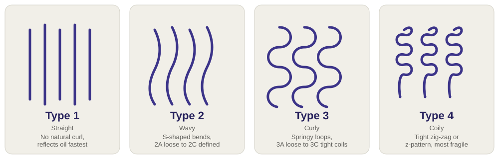

# Gabby's — context brief for a fresh AI session

This file exists so you can paste it into a different chat (a new Claude/ChatGPT/etc.
conversation with no memory of this project) and have it understand the whole app well
enough to suggest or make real improvements — without needing repo access.

## What it is

A real, honest product-ingredient scanner for haircare — the same idea as Yuka or Think
Dirty, but for hair products instead of food/skincare. Single-file client-side web app,
no build step, no framework, no backend. Built as a sibling project to a separate game
called Ultron Valley, sharing the same core rule: **never fabricate data**. If a real
number/claim isn't available, the app says so plainly instead of inventing something
plausible-looking.

## What it actually does (all real, verified working)

- **Scans a barcode with the camera.** Chrome/Edge/Android use the browser's native
  `BarcodeDetector` API. Safari (iPhone/iPad/Mac) has never implemented that API, so a
  fallback — [ZXing](https://github.com/zxing-js/library) (real, open-source, MIT
  licensed) — is used there instead, vendored locally in `vendor/` rather than fetched
  from a CDN at scan time.
- **Looks up the real product** via [Open Beauty Facts](https://world.openbeautyfacts.org)
  (same organization as Open Food Facts) — free, open, crowdsourced, CORS-open, no API
  key needed.
- **Scores it 0–100 with a fully transparent, published rule list** (`data/ingredient-
  rules.json`, embedded in full below) — every point lost is shown with the exact
  ingredient, a plain-language "why," and a version explained simply enough for a
  five-year-old. Never a black-box number.
- **Hair type (standard 1–4 system) + color profile**, stored in `localStorage`, with an
  original hand-authored SVG illustration (not traced from any photo).
- **Category-browsable recommendations** — real products fetched live from Open Beauty
  Facts per category, scored with the exact same rules, sorted best-to-worst.
- **Shareable results**: `?barcode=<code>` in the URL pre-fills and looks the product up
  on load.
- **Mobile-first, verified at the exact iPhone 14 viewport (390×844)**: 44px touch
  targets, 16px inputs (prevents iOS zoom-on-focus), safe-area-inset padding for the
  notch, sticky nav, Add-to-Home-Screen support (real `manifest.json` + icon + Apple meta
  tags — opens full-screen like a native app once added).

## The one real, unavoidable constraint

iOS Safari only grants camera access (`getUserMedia`) on a *secure context* — `https://`
or `localhost`. Running the local static server and opening its LAN IP from a phone
(`http://192.168.x.x:8770`) will **always** deny camera permission — that's Apple's own
OS-level rule, not a bug in this app. Manual barcode entry and name search work fine over
plain HTTP regardless. To get live camera scanning on a real phone: deploy with real
HTTPS (GitHub Pages / Netlify / Vercel — free, static-only, no backend needed since
everything already runs client-side) or use a temporary tunnel (e.g. `cloudflared
tunnel --url http://localhost:8770`) for testing.

## Guardrails to preserve (please don't undo these)

- **No fabrication, ever.** No invented scores, reviews, "verified safe" claims, or
  proprietary black-box scoring. The whole point of the app is that the methodology is
  always visible.
- Don't quietly add a paid/proprietary layer over the transparent rule list.
- Keep the "what this app does not do" honesty (not a medical/dermatological judgment,
  not a lab test, doesn't know personal allergies) visible, not buried.
- No build step / framework has been introduced by design — it's intentionally a single
  static site. If you think a build step is genuinely warranted, say so explicitly rather
  than just introducing one.

## Genuinely open ideas for improvement (not a prescriptive to-do list)

- Offline support (service worker) for spotty in-store wifi/cell signal.
- Expand `data/ingredient-rules.json` past its current 10 rules (v0.1) — more coverage,
  more nuance.
- Wire the hair type/color profile into the *scoring* itself (right now it only affects
  what "Recommendations" fetches, not point weighting) — if you do this, keep it
  transparent (show which rule fired *because of* the profile, don't hide it).
- On-device scan history (no account, `localStorage` only).
- Better empty-state UX when a barcode has no Open Beauty Facts match — e.g. a link to
  contribute the product to Open Beauty Facts instead of a dead end.
- Accessibility pass — no ARIA audit has been done yet.
- Side-by-side product comparison mode.
- Automated tests — currently everything has been verified manually via browser
  screenshots each session; there's no regression test suite.

## Files (this is the entire app)

- `index.html` — everything: markup, CSS, JS. Full source below.
- `data/ingredient-rules.json` — scoring rules + methodology string. Full source below.
- `manifest.json` — PWA manifest. Full source below.
- `art/hair-types.svg` — original illustration (not included inline here, but it's a
  simple 4-panel hand-authored SVG, small file).
- `art/icon-512.png` — app icon, used directly for both `apple-touch-icon` and the
  manifest (deliberately one real asset, not multiple mislabeled sizes).
- `vendor/zxing-0.21.3.min.js` — vendored barcode decoder, don't hand-edit, replace by
  re-downloading the same pinned version if it ever needs updating.
- `run-local.sh` / `run-local.bat` — serve on port 8770. Must be real HTTP, not
  `file://`, or the `fetch()` calls to Open Beauty Facts break under a `null` origin.
- `README.md` — user-facing docs, includes the "what it does / does not do" honesty list.
- `CLAUDE.md` — a standing rule for AI assistants working on this repo: always end a
  response touching this app with a verified-live link to it.

---

## Full source: `index.html`

```html
<!doctype html>
<html lang="en">
<head>
<meta charset="utf-8"/>
<meta name="viewport" content="width=device-width, initial-scale=1, viewport-fit=cover"/>
<title>Gabby's — scan it, understand it</title>
<meta name="apple-mobile-web-app-capable" content="yes"/>
<meta name="mobile-web-app-capable" content="yes"/>
<meta name="apple-mobile-web-app-status-bar-style" content="default"/>
<meta name="apple-mobile-web-app-title" content="Gabby's"/>
<meta name="theme-color" content="#3C3489"/>
<link rel="apple-touch-icon" href="art/icon-512.png"/>
<link rel="icon" href="art/icon-512.png"/>
<link rel="manifest" href="manifest.json"/>
<link rel="preconnect" href="https://world.openbeautyfacts.org"/>
<link rel="dns-prefetch" href="https://world.openbeautyfacts.org"/>
<style>
  :root {
    --ink:#26215C; --ink2:#3C3489; --bg:#F7F6F2; --card:#FFFFFF; --border:#E3E1D8;
    --muted:#5F5E5A; --good:#0F6E56; --mid:#854F0B; --bad:#791F1F;
    --good-bg:#E1F5EE; --mid-bg:#FAEEDA; --bad-bg:#FAECE7;
  }
  * { box-sizing:border-box; -webkit-tap-highlight-color:transparent; }
  html { -webkit-text-size-adjust:100%; }
  body { margin:0; font-family:-apple-system,Segoe UI,Arial,sans-serif; background:var(--bg); color:var(--ink);
    padding-left:env(safe-area-inset-left); padding-right:env(safe-area-inset-right); padding-bottom:env(safe-area-inset-bottom); }
  header { padding:calc(1.4rem + env(safe-area-inset-top)) 1.2rem 1rem; text-align:center; }
  header h1 { margin:0 0 0.2rem; font-size:1.6rem; }
  header p { margin:0; color:var(--muted); font-size:0.9rem; }
  nav { display:flex; justify-content:center; gap:0.6rem; flex-wrap:wrap; padding:0.6rem 1rem; position:sticky; top:0; background:var(--bg); z-index:10; }
  nav button { border:1px solid var(--border); background:var(--card); color:var(--ink); padding:0.6rem 1.1rem; border-radius:999px; font-size:0.9rem; cursor:pointer; font-weight:600; min-height:44px; touch-action:manipulation; }
  nav button.active { background:var(--ink2); color:#fff; border-color:var(--ink2); }
  main { max-width:920px; margin:0 auto; padding:0 1rem 3rem; }
  section { display:none; }
  section.active { display:block; }
  .card { background:var(--card); border:1px solid var(--border); border-radius:14px; padding:1.2rem; margin-bottom:1rem; }
  .row { display:flex; gap:0.6rem; flex-wrap:wrap; align-items:center; }
  input[type=text], input[type=search] { flex:1; min-width:200px; padding:0.75rem 0.8rem; border:1px solid var(--border); border-radius:8px; font-size:16px; min-height:44px; }
  button.primary { background:var(--ink2); color:#fff; border:none; padding:0.75rem 1.2rem; border-radius:8px; font-weight:700; cursor:pointer; font-size:1rem; min-height:44px; touch-action:manipulation; }
  button.ghost { background:transparent; border:1px solid var(--border); padding:0.7rem 1.1rem; border-radius:8px; cursor:pointer; font-weight:600; min-height:44px; touch-action:manipulation; }
  .muted { color:var(--muted); font-size:0.85rem; }
  .score-wrap { display:flex; align-items:center; gap:1.2rem; flex-wrap:wrap; }
  .score-circle { width:96px; height:96px; border-radius:50%; display:flex; align-items:center; justify-content:center; font-size:1.7rem; font-weight:800; flex-shrink:0; border:6px solid; }
  .flag { border:1px solid var(--border); border-radius:10px; padding:0.7rem 0.9rem; margin-top:0.6rem; }
  .flag .head { display:flex; justify-content:space-between; align-items:center; font-weight:700; }
  .flag .pts { font-size:0.8rem; font-weight:700; }
  .flag .why { font-size:0.85rem; color:var(--muted); margin-top:0.2rem; }
  .flag .kid { font-size:0.9rem; margin-top:0.4rem; background:#F1EFE8; padding:0.5rem 0.7rem; border-radius:8px; }
  .sev-high { color:var(--bad); }
  .sev-medium { color:var(--mid); }
  .sev-low { color:var(--good); }
  .hair-grid { display:grid; grid-template-columns:repeat(auto-fit,minmax(200px,1fr)); gap:0.7rem; margin-top:0.8rem; }
  .hair-opt { border:2px solid var(--border); border-radius:12px; padding:0.8rem; cursor:pointer; text-align:center; }
  .hair-opt.sel { border-color:var(--ink2); background:#EEEDFE; }
  .color-swatches { display:flex; gap:0.6rem; flex-wrap:wrap; margin-top:0.6rem; }
  .swatch { width:40px; height:40px; border-radius:50%; border:2px solid var(--border); cursor:pointer; }
  .swatch.sel { border-color:var(--ink2); box-shadow:0 0 0 2px var(--ink2); }
  .cat-tabs { display:flex; gap:0.5rem; flex-wrap:wrap; margin-bottom:0.8rem; }
  .cat-tabs button { border:1px solid var(--border); background:var(--card); padding:0.4rem 0.8rem; border-radius:999px; font-size:0.82rem; cursor:pointer; }
  .cat-tabs button.active { background:var(--ink); color:#fff; }
  .prod-list { display:grid; grid-template-columns:repeat(auto-fill,minmax(220px,1fr)); gap:0.8rem; }
  .prod-card { border:1px solid var(--border); border-radius:12px; padding:0.8rem; }
  .prod-card .name { font-weight:700; font-size:0.92rem; }
  .prod-card .brand { color:var(--muted); font-size:0.8rem; }
  .prod-score { display:inline-block; padding:0.15rem 0.5rem; border-radius:999px; font-weight:800; font-size:0.85rem; margin-top:0.4rem; }
  .note-box { background:#EEEDFE; border-radius:10px; padding:0.8rem 1rem; font-size:0.85rem; color:var(--ink2); margin-bottom:1rem; }
  @media (max-width:480px) {
    .row input[type=text], .row input[type=search] { flex-basis:100%; min-width:0; }
    .row button.ghost { flex-basis:100%; }
  }
</style>
</head>
<body>

<header>
  <h1>🧴 Gabby's</h1>
  <p>Scan a product, get a real breakdown of what's actually in it — explained simply, nothing hidden.</p>
</header>

<nav>
  <button data-tab="scan" class="active">Scan a product</button>
  <button data-tab="profile">Your hair</button>
  <button data-tab="recs">Recommendations</button>
</nav>

<main>

<section id="tab-scan" class="active">
  <div class="note-box">
    <b>How this works, honestly:</b> the score comes from a transparent, published rule list
    (see "how scoring works" below) applied to a product's real ingredient list from
    <a href="https://world.openbeautyfacts.org" target="_blank" rel="noopener">Open Beauty Facts</a>,
    a free, open, crowdsourced database — not a proprietary lab test, and not a medical opinion.
    Camera scanning uses your browser's real barcode reader (no camera library download, no
    account, nothing leaves your device except the barcode number sent to look up the product).
  </div>

  <div class="card">
    <div class="row">
      <button class="primary" id="btn-scan-camera">📷 Scan barcode with camera</button>
      <span class="muted" id="camera-support-note"></span>
    </div>
    <video id="scan-video" style="width:100%;max-width:420px;border-radius:10px;margin-top:0.8rem;display:none;" muted playsinline></video>
    <div class="row" style="margin-top:0.8rem;">
      <input type="text" id="manual-barcode" placeholder="...or type a barcode number (UPC/EAN)"/>
      <button class="ghost" id="btn-lookup-barcode">Look up</button>
    </div>
    <div class="row" style="margin-top:0.5rem;">
      <input type="search" id="manual-search" placeholder="...or search by product name, e.g. 'Garnier shampoo'"/>
      <button class="ghost" id="btn-search-name">Search</button>
    </div>
    <p class="muted" id="scan-status"></p>
  </div>

  <div class="card" id="result-card" style="display:none;"></div>

  <details class="card">
    <summary style="cursor:pointer; font-weight:700;">How scoring works (the full transparent list)</summary>
    <div id="methodology-body"></div>
  </details>
</section>

<section id="tab-profile">
  <div class="card">
    <h3 style="margin-top:0;">Hair type</h3>
    <p class="muted">The standard 1–4 typing system used across the haircare industry. This changes what "highly rated" means for you on the Recommendations tab.</p>
    
    <div class="hair-grid" id="hair-type-grid"></div>
  </div>
  <div class="card">
    <h3 style="margin-top:0;">Hair color</h3>
    <p class="muted">Color-treated hair reacts differently to sulfates and alcohols — this tunes recommendations too.</p>
    <div class="color-swatches" id="hair-color-grid"></div>
  </div>
</section>

<section id="tab-recs">
  <div class="note-box">
    Real products from Open Beauty Facts, scored with the same transparent rules as the scanner,
    sorted best-to-worst. "Highly rated" here means "scored well against our published ingredient
    checklist" — not an independent lab test or a paid placement.
  </div>
  <div class="cat-tabs" id="rec-cat-tabs"></div>
  <p class="muted" id="rec-status"></p>
  <div class="prod-list" id="rec-list"></div>
</section>


<footer style="max-width:920px;margin:0 auto;padding:0 1rem 2rem;text-align:center;">
  <p class="muted">Built the same honest way as its sibling project —
    <a href="http://127.0.0.1:8765/" target="_blank" rel="noopener">Ultron Valley</a>:
    real data, transparent scoring shown in full, nothing fabricated to look more finished
    than it is. Run that project's own local server first to open it.</p>
</footer>
</main>

<script>
const RULES_URL = "./data/ingredient-rules.json";
let RULES = null;

async function loadRules() {
  if (RULES) return RULES;
  const res = await fetch(RULES_URL);
  RULES = await res.json();
  return RULES;
}

function scoreIngredients(ingredientsText) {
  const text = (ingredientsText || "").toLowerCase();
  const hits = [];
  let score = 100;
  for (const rule of RULES.ingredients) {
    const matched = rule.match.some((m) => text.includes(m.toLowerCase()));
    if (matched) {
      score -= rule.points;
      hits.push(rule);
    }
  }
  score = Math.max(5, Math.min(100, score));
  return { score, hits };
}

function scoreColor(score) {
  if (score >= 75) return { fg: "var(--good)", bg: "var(--good-bg)" };
  if (score >= 45) return { fg: "var(--mid)", bg: "var(--mid-bg)" };
  return { fg: "var(--bad)", bg: "var(--bad-bg)" };
}

function esc(s) { return String(s || "").replace(/[<>&]/g, (c) => ({"<":"&lt;",">":"&gt;","&":"&amp;"}[c])); }

function renderResult(product, ingredientsText) {
  const card = document.getElementById("result-card");
  card.style.display = "block";
  if (!product && !ingredientsText) {
    card.innerHTML = '<p class="muted">Product not found in Open Beauty Facts. Try a different barcode, or search by name.</p>';
    return;
  }
  const { score, hits } = scoreIngredients(ingredientsText);
  const c = scoreColor(score);
  const name = (product && (product.product_name || product.product_name_en)) || "Unknown product";
  const brand = (product && product.brands) || "";
  const img = product && product.image_front_small_url;

  let html = '<div style="display:flex; gap:1rem; flex-wrap:wrap; align-items:flex-start;">';
  if (img) html += '';
  html += '<div style="flex:1;min-width:200px;">';
  html += '<div style="font-weight:800;font-size:1.1rem;">' + esc(name) + '</div>';
  if (brand) html += '<div class="muted">' + esc(brand) + '</div>';
  html += '<div class="score-wrap" style="margin-top:0.8rem;">';
  html += '<div class="score-circle" style="color:' + c.fg + ';border-color:' + c.fg + ';background:' + c.bg + ';">' + score + '</div>';
  html += '<div><div style="font-weight:700;">' + score + ' / 100</div><div class="muted">100 to start, minus points for each flagged ingredient found — see below.</div></div>';
  html += '</div></div></div>';

  if (!ingredientsText) {
    html += '<p class="muted" style="margin-top:0.8rem;">No ingredient list on file for this product in Open Beauty Facts, so no score could be calculated — showing what we do know.</p>';
  } else if (!hits.length) {
    html += '<p style="margin-top:0.8rem;">✅ None of our tracked ingredients showed up in this product\'s list. That doesn\'t guarantee it\'s perfect for you, but it cleared every check on our published list.</p>';
  } else {
    html += '<div style="margin-top:1rem;"><b>What brought the score down:</b>';
    hits.forEach((h) => {
      html += '<div class="flag"><div class="head"><span class="sev-' + h.severity + '">' + esc(h.label) + '</span><span class="pts sev-' + h.severity + '">-' + h.points + ' pts</span></div>' +
        '<div class="why">' + esc(h.why) + '</div>' +
        '<div class="kid">🧒 In simple terms: ' + esc(h.kid_explainer) + '</div></div>';
    });
    html += '</div>';
  }
  if (ingredientsText) {
    html += '<details style="margin-top:1rem;"><summary style="cursor:pointer;font-weight:600;font-size:0.85rem;">Full ingredient list</summary><p class="muted" style="font-size:0.82rem;">' + esc(ingredientsText) + '</p></details>';
  }
  card.innerHTML = html;
}

async function lookupBarcode(code) {
  const status = document.getElementById("scan-status");
  status.textContent = "Looking up " + code + "…";
  try {
    const res = await fetch("https://world.openbeautyfacts.org/api/v2/product/" + encodeURIComponent(code) + ".json?fields=product_name,brands,ingredients_text,image_front_small_url");
    const data = await res.json();
    if (data.status !== 1 || !data.product) {
      status.textContent = "Not found in Open Beauty Facts.";
      renderResult(null, null);
      return;
    }
    status.textContent = "Found it.";
    renderResult(data.product, data.product.ingredients_text);
  } catch (e) {
    status.textContent = "Lookup failed — check your connection.";
  }
}

async function searchByName(q) {
  const status = document.getElementById("scan-status");
  status.textContent = "Searching for \"" + q + "\"…";
  try {
    const res = await fetch("https://world.openbeautyfacts.org/api/v2/search?search_terms=" + encodeURIComponent(q) + "&fields=product_name,brands,ingredients_text,image_front_small_url&page_size=1");
    const data = await res.json();
    const p = data.products && data.products[0];
    if (!p) { status.textContent = "No match found."; renderResult(null, null); return; }
    status.textContent = "Closest match:";
    renderResult(p, p.ingredients_text);
  } catch (e) {
    status.textContent = "Search failed — check your connection.";
  }
}

function renderMethodology() {
  const root = document.getElementById("methodology-body");
  let html = '<p class="muted">' + esc(RULES.methodology) + '</p>';
  RULES.ingredients.forEach((h) => {
    html += '<div class="flag"><div class="head"><span class="sev-' + h.severity + '">' + esc(h.label) + '</span><span class="pts sev-' + h.severity + '">-' + h.points + ' pts</span></div>' +
      '<div class="why">' + esc(h.why) + '</div></div>';
  });
  root.innerHTML = html;
}

// --- Camera barcode scanning ---
// Chrome/Edge/Android get the browser's OWN native BarcodeDetector API: no library, no
// download. Safari (iPhone/iPad/Mac) has never implemented BarcodeDetector, so without a
// fallback, scanning would silently not work for anyone on an iPhone -- the single most
// likely device for "scan a product in the aisle." The fallback is ZXing, a real, widely-used
// open-source decoder (MIT license, github.com/zxing-js/library) that reads camera frames in
// plain JS/canvas -- no native browser API dependency, so it works in Safari. Vendored locally
// (vendor/zxing-0.21.3.min.js) rather than fetched from a CDN at scan time -- one less runtime
// third-party network dependency, and it still only loads for browsers that actually need it.
let scanStream = null;
let zxingReader = null;
let zxingLoadPromise = null;
function loadZXing() {
  if (window.ZXing) return Promise.resolve();
  if (zxingLoadPromise) return zxingLoadPromise;
  zxingLoadPromise = new Promise((resolve, reject) => {
    const s = document.createElement("script");
    s.src = "vendor/zxing-0.21.3.min.js";
    s.onload = resolve;
    s.onerror = () => reject(new Error("zxing failed to load"));
    document.head.appendChild(s);
  });
  return zxingLoadPromise;
}
async function startCameraScan() {
  const status = document.getElementById("scan-status");
  if (!("mediaDevices" in navigator) || !navigator.mediaDevices.getUserMedia) {
    status.textContent = "This browser doesn't support camera access. Use manual entry below instead.";
    return;
  }
  if ("BarcodeDetector" in window) return startCameraScanNative(status);
  status.textContent = "Loading scanner…";
  try {
    await loadZXing();
  } catch (e) {
    status.textContent = "Couldn't load the barcode scanner (check your internet connection). Use manual entry instead.";
    return;
  }
  return startCameraScanZXing(status);
}
async function startCameraScanNative(status) {
  try {
    scanStream = await navigator.mediaDevices.getUserMedia({ video: { facingMode: "environment" } });
  } catch (e) {
    status.textContent = "Camera access denied or unavailable. Use manual entry instead.";
    return;
  }
  const video = document.getElementById("scan-video");
  video.srcObject = scanStream;
  video.style.display = "block";
  await video.play();
  const detector = new BarcodeDetector({ formats: ["ean_13", "ean_8", "upc_a", "upc_e", "qr_code"] });
  status.textContent = "Point the camera at a barcode…";
  const loop = async () => {
    if (!scanStream) return;
    try {
      const codes = await detector.detect(video);
      if (codes.length) {
        stopCameraScan();
        document.getElementById("manual-barcode").value = codes[0].rawValue;
        lookupBarcode(codes[0].rawValue);
        return;
      }
    } catch (_) {}
    requestAnimationFrame(loop);
  };
  loop();
}
async function startCameraScanZXing(status) {
  const video = document.getElementById("scan-video");
  video.style.display = "block";
  zxingReader = new ZXing.BrowserMultiFormatReader();
  status.textContent = "Point the camera at a barcode…";
  try {
    await zxingReader.decodeFromConstraints(
      { video: { facingMode: "environment" } },
      video,
      (result) => {
        if (result) {
          const code = result.getText();
          stopCameraScan();
          document.getElementById("manual-barcode").value = code;
          lookupBarcode(code);
        }
      }
    );
  } catch (e) {
    video.style.display = "none";
    status.textContent = "Camera access denied or unavailable. Use manual entry instead.";
  }
}
function stopCameraScan() {
  if (scanStream) { scanStream.getTracks().forEach((t) => t.stop()); scanStream = null; }
  if (zxingReader) { try { zxingReader.reset(); } catch (_) {} zxingReader = null; }
  document.getElementById("scan-video").style.display = "none";
}

// --- Hair profile ---
const HAIR_TYPES = [
  { id: "1", label: "Type 1 — Straight" },
  { id: "2", label: "Type 2 — Wavy" },
  { id: "3", label: "Type 3 — Curly" },
  { id: "4", label: "Type 4 — Coily" }
];
const HAIR_COLORS = [
  { id: "black", hex: "#0b0b0b" }, { id: "brown", hex: "#5a3a22" },
  { id: "blonde", hex: "#e8c77e" }, { id: "red", hex: "#a33d1f" },
  { id: "gray", hex: "#b8b8b8" }, { id: "dyed", hex: "#8a4fd6" }
];
function loadProfile() {
  try { return JSON.parse(localStorage.getItem("iq-profile") || "{}"); } catch (_) { return {}; }
}
function saveProfile(p) { try { localStorage.setItem("iq-profile", JSON.stringify(p)); } catch (_) {} }

function renderHairGrid() {
  const profile = loadProfile();
  const grid = document.getElementById("hair-type-grid");
  grid.innerHTML = HAIR_TYPES.map((t) =>
    '<div class="hair-opt' + (profile.hairType === t.id ? " sel" : "") + '" data-type="' + t.id + '">' + esc(t.label) + '</div>'
  ).join("");
  grid.querySelectorAll(".hair-opt").forEach((el) => {
    el.addEventListener("click", () => {
      const p = loadProfile(); p.hairType = el.dataset.type; saveProfile(p);
      renderHairGrid(); renderRecList();
    });
  });
  const colorGrid = document.getElementById("hair-color-grid");
  colorGrid.innerHTML = HAIR_COLORS.map((c) =>
    '<div class="swatch' + (profile.hairColor === c.id ? " sel" : "") + '" data-color="' + c.id + '" style="background:' + c.hex + ';" title="' + c.id + '"></div>'
  ).join("");
  colorGrid.querySelectorAll(".swatch").forEach((el) => {
    el.addEventListener("click", () => {
      const p = loadProfile(); p.hairColor = el.dataset.color; saveProfile(p);
      renderHairGrid();
    });
  });
}

// --- Recommendations by category ---
const REC_CATEGORIES = [
  { id: "shampoos", label: "Shampoo" },
  { id: "conditioners", label: "Conditioner" },
  { id: "hair-oils", label: "Hair oil" },
  { id: "hair-styling-products", label: "Styling" },
  { id: "hair-masks", label: "Treatment / mask" }
];
let currentRecCat = REC_CATEGORIES[0].id;
const recCache = {};

function renderRecTabs() {
  const root = document.getElementById("rec-cat-tabs");
  root.innerHTML = REC_CATEGORIES.map((c) =>
    '<button data-cat="' + c.id + '" class="' + (c.id === currentRecCat ? "active" : "") + '">' + esc(c.label) + '</button>'
  ).join("");
  root.querySelectorAll("button").forEach((b) => {
    b.addEventListener("click", () => { currentRecCat = b.dataset.cat; renderRecTabs(); renderRecList(); });
  });
}

async function renderRecList() {
  const status = document.getElementById("rec-status");
  const listEl = document.getElementById("rec-list");
  if (recCache[currentRecCat]) {
    renderScoredList(recCache[currentRecCat]);
    return;
  }
  status.textContent = "Fetching real " + currentRecCat + " and scoring them…";
  listEl.innerHTML = "";
  try {
    const res = await fetch("https://world.openbeautyfacts.org/api/v2/search?categories_tags=" + currentRecCat +
      "&fields=product_name,brands,ingredients_text,image_front_small_url&page_size=24");
    const data = await res.json();
    const scored = (data.products || [])
      .filter((p) => p.product_name && p.ingredients_text)
      .map((p) => ({ p, s: scoreIngredients(p.ingredients_text) }))
      .sort((a, b) => b.s.score - a.s.score)
      .slice(0, 9);
    recCache[currentRecCat] = scored;
    status.textContent = scored.length ? ("Top " + scored.length + " by score, out of what Open Beauty Facts has listed for this category with a usable ingredient list.") : "";
    renderScoredList(scored);
  } catch (e) {
    status.textContent = "Couldn't fetch recommendations — check your connection.";
  }
}
function renderScoredList(scored) {
  const listEl = document.getElementById("rec-list");
  if (!scored.length) { listEl.innerHTML = '<p class="muted">No scoreable products found for this category right now.</p>'; return; }
  listEl.innerHTML = scored.map(({ p, s }) => {
    const c = scoreColor(s.score);
    return '<div class="prod-card"><div class="name">' + esc(p.product_name) + '</div>' +
      '<div class="brand">' + esc(p.brands || "") + '</div>' +
      '<span class="prod-score" style="color:' + c.fg + ';background:' + c.bg + ';">' + s.score + '/100</span></div>';
  }).join("");
}

// --- Nav wiring ---
document.querySelectorAll("nav button").forEach((btn) => {
  btn.addEventListener("click", () => {
    document.querySelectorAll("nav button").forEach((b) => b.classList.remove("active"));
    document.querySelectorAll("main section").forEach((s) => s.classList.remove("active"));
    btn.classList.add("active");
    document.getElementById("tab-" + btn.dataset.tab).classList.add("active");
  });
});

document.getElementById("btn-scan-camera").addEventListener("click", startCameraScan);
document.getElementById("btn-lookup-barcode").addEventListener("click", () => {
  const v = document.getElementById("manual-barcode").value.trim();
  if (v) lookupBarcode(v);
});
document.getElementById("btn-search-name").addEventListener("click", () => {
  const v = document.getElementById("manual-search").value.trim();
  if (v) searchByName(v);
});

(async function init() {
  document.getElementById("camera-support-note").textContent =
    ("mediaDevices" in navigator && navigator.mediaDevices.getUserMedia)
      ? (("BarcodeDetector" in window) ? "(uses your browser's built-in scanner)" : "(uses an in-browser scanner — works on iPhone/Safari too)")
      : "(this browser has no camera access — use manual entry)";
  await loadRules();
  renderMethodology();
  renderHairGrid();
  renderRecTabs();
  renderRecList();

  // Shareable scan results: ?barcode=<code> pre-fills and looks up on load,
  // so a result can be linked or bookmarked, not just reached by re-scanning.
  const params = new URLSearchParams(location.search);
  const sharedBarcode = params.get("barcode");
  if (sharedBarcode) {
    document.getElementById("manual-barcode").value = sharedBarcode;
    lookupBarcode(sharedBarcode);
  }
})();
</script>
</body>
</html>
```

---

## Full source: `data/ingredient-rules.json`

```json
{
  "version": "0.1",
  "methodology": "Every product starts at 100. Each matched ingredient below subtracts its listed points, once per match. Score floors at 5 (never 0 -- this is a simplified consumer heuristic, not a toxicology report, and shouldn't read as 'this will hurt you'). The full list of what matched and how many points each cost is always shown -- nothing is hidden in a black-box number. This is one transparent way of reading a label, built from well-documented, widely-cited consumer ingredient concerns (the kind you'll find on INCI/ingredient-decoder sites) -- it is not a medical, dermatological, or regulatory judgment, and it doesn't know your personal allergies or sensitivities. When in doubt about a real reaction, ask a dermatologist, not an app.",
  "ingredients": [
    {
      "match": ["sodium lauryl sulfate", "sls"],
      "label": "Sodium Lauryl Sulfate (SLS)",
      "points": 10,
      "severity": "medium",
      "kid_explainer": "This is a strong soap that makes big bubbles. It's really good at cleaning, but it also washes away the healthy oils your hair needs -- kind of like washing a soft stuffed animal with dish soap. Your hair can end up feeling dry and rough afterward.",
      "why": "A strong anionic surfactant. Effective cleanser but can strip natural sebum, leaving hair and scalp dry, and can irritate sensitive skin with repeated use."
    },
    {
      "match": ["sodium laureth sulfate", "sles", "sodium myreth sulfate"],
      "label": "Sodium Laureth Sulfate (SLES)",
      "points": 6,
      "severity": "low",
      "kid_explainer": "This is a gentler cousin of the strong soap above. It still cleans really well but is a little less rough on your hair.",
      "why": "Milder than SLS but still a strong cleanser; can dry out hair with frequent use. Manufacturing can leave trace 1,4-dioxane, a byproduct regulators have flagged for reduction, though it isn't an added ingredient."
    },
    {
      "match": ["methylparaben", "propylparaben", "butylparaben", "isobutylparaben", "ethylparaben"],
      "label": "Parabens",
      "points": 15,
      "severity": "high",
      "kid_explainer": "This is like putting a tiny preservative guard in the bottle so it doesn't grow mold, kind of like keeping your lunch in the fridge. Scientists are still studying whether using a lot of this stuff over many years could confuse hormones in your body.",
      "why": "Preservatives that some studies suggest may mimic estrogen (endocrine disruption). Evidence is still debated, but several parabens are restricted in the EU at higher concentrations, so many brands avoid them as a precaution."
    },
    {
      "match": ["dmdm hydantoin", "quaternium-15", "diazolidinyl urea", "imidazolidinyl urea", "sodium hydroxymethylglycinate"],
      "label": "Formaldehyde-releasing preservative",
      "points": 15,
      "severity": "high",
      "kid_explainer": "This ingredient slowly lets out tiny, tiny puffs of a chemical called formaldehyde to keep germs from growing -- the same chemical museums use to keep old things from rotting. A little over a long time can bother your eyes, nose, or skin.",
      "why": "Releases small amounts of formaldehyde over time to prevent microbial growth. Formaldehyde is a recognized skin/eye irritant and classified as a human carcinogen at high, repeated exposure -- the amounts here are tiny, but it's a well-documented reason people look for 'formaldehyde-free' labels."
    },
    {
      "match": ["phthalate", "dbp", "dep"],
      "label": "Phthalates",
      "points": 15,
      "severity": "high",
      "kid_explainer": "This chemical is often hidden inside the word 'fragrance' on the label -- companies don't have to say exactly what's in their scent recipe. Some scientists worry it can affect how your body's hormones work.",
      "why": "Often used to make fragrance last longer, and frequently hidden under the generic 'fragrance/parfum' label. Linked to endocrine disruption in multiple studies; increasingly phased out but still found in some products."
    },
    {
      "match": ["triclosan"],
      "label": "Triclosan",
      "points": 15,
      "severity": "high",
      "kid_explainer": "This is a strong germ-killer, like tiny soldiers fighting bacteria. But it's so strong that scientists worry it might mess with hormones and help create 'super germs' that are harder to kill.",
      "why": "An antibacterial agent linked to hormone disruption and antibiotic resistance concerns. Banned from hand soaps in the US (FDA, 2016) and phased out of many personal care products since."
    },
    {
      "match": ["alcohol denat", "sd alcohol", "isopropyl alcohol", "alcohol denat."],
      "label": "Denatured/Isopropyl Alcohol",
      "points": 8,
      "severity": "medium",
      "kid_explainer": "This is a fast-drying liquid, like hand sanitizer. It helps a product dry quickly on your hair, but it can also suck the moisture out, making hair feel dry and a bit brittle, like a dry twig.",
      "why": "Short-chain 'drying' alcohols evaporate quickly and can dehydrate hair with regular use -- different from fatty alcohols (cetyl, stearyl, cetearyl) which are actually moisturizing and not flagged here."
    },
    {
      "match": ["dimethicone", "cyclopentasiloxane", "amodimethicone", "cyclomethicone", "dimethiconol"],
      "label": "Silicones",
      "points": 4,
      "severity": "low",
      "kid_explainer": "Think of this like a tiny, smooth raincoat wrapped around each hair. It makes hair feel silky and shiny right away. But if you don't wash it out well sometimes, it can build up like a plastic layer and make hair feel heavy or flat over time -- especially for fine, thin hair.",
      "why": "Not toxic -- this is a build-up/compatibility note, not a safety flag. Great for smoothing and shine, especially on coarse or curly hair, but can accumulate on fine or low-porosity hair without regular clarifying washes."
    },
    {
      "match": ["mineral oil", "petrolatum", "paraffinum liquidum"],
      "label": "Mineral Oil / Petrolatum",
      "points": 3,
      "severity": "low",
      "kid_explainer": "This is a smooth, protective oil, kind of like putting a raincoat over your hair to lock moisture in. It works well for a lot of people, but for some hair types it can feel heavy or greasy instead of soaking in.",
      "why": "Cosmetic-grade mineral oil/petrolatum is well-refined and considered safe by major dermatology bodies; flagged lightly here only because it can feel heavy on fine hair and doesn't absorb the way plant oils do."
    },
    {
      "match": ["fragrance", "parfum"],
      "label": "Undisclosed Fragrance",
      "points": 5,
      "severity": "low",
      "kid_explainer": "Companies don't have to tell you exactly what makes up the smell in a product -- they can just write one word, 'fragrance', to cover a whole secret recipe of scent chemicals. That makes it hard to know exactly what you're putting on your hair.",
      "why": "'Fragrance' can legally hide dozens of undisclosed chemicals, including allergens and sometimes phthalates. Not inherently dangerous, but a transparency gap that makes it harder to identify what's actually triggering a reaction if you have sensitive skin."
    }
  ]
}
```

---

## Full source: `manifest.json`

```json
{
  "name": "Gabby's",
  "short_name": "Gabby's",
  "description": "Scan a product, get a real breakdown of what's actually in it.",
  "start_url": "./",
  "display": "standalone",
  "background_color": "#F7F6F2",
  "theme_color": "#3C3489",
  "icons": [
    { "src": "art/icon-512.png", "sizes": "512x512", "type": "image/png" }
  ]
}
```

---

## If you're an AI reading this in a fresh chat

Feel free to suggest concrete diffs/patches against the source above. Please:
1. Keep every change consistent with "no fabrication, ever" — if a change would require
   inventing data (fake reviews, fake lab results, a made-up "safety certified" badge),
   don't.
2. Note clearly which parts of your suggestion are real/verifiable vs. genuinely new
   product decisions Mason (the project owner) needs to make.
3. If you propose a new external dependency, name it explicitly and note its license —
   this project has a habit of vendoring dependencies locally rather than pulling from a
   CDN at runtime (see the ZXing note above).
